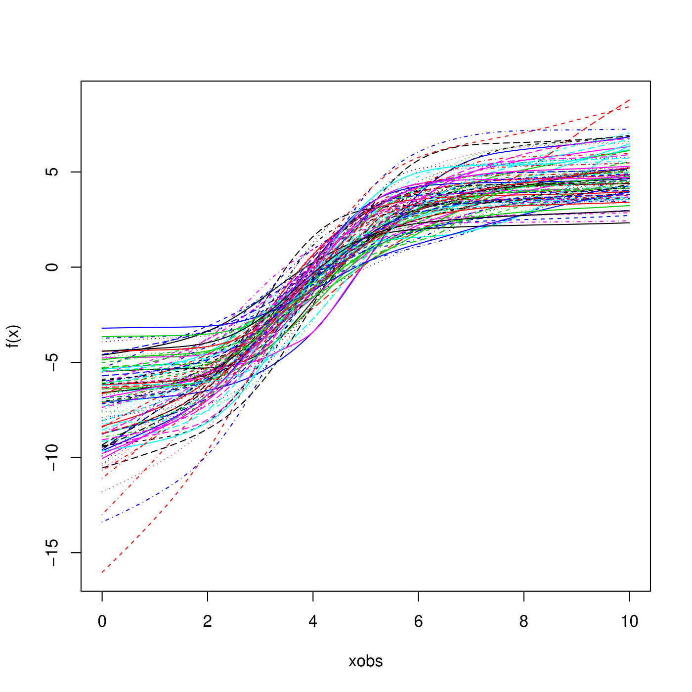

# HBSARSC v0.1.0
Hierarchical Bayesian Spectral Analysis Regression with Shape Constraints
## Authors
Taeryon Choi, Korea University  (trchoi@korea.ac.kr) <br/>
Peter Lenk, University of Michigan (plenk@umich.edu)
## Maintainer
Jangwon Lee, Korea University (jangwonlee@korea.ac.kr)
# Introduction
We propose an hierarchical Bayes (HB) model for functional data analysis where different groups have different flexible regression functions. We use HB Gaussian processes to model the functions at the lower-level (within groups) and upper-level (between groups). The spectral coefficients of the Gaussian processes have HB smoothing priors that serve two roles: they describe the heterogeneity in the spectral coefficients across groups, and they determine the smoothness of the flexible functions. The HB model is particularly appropriate when data within groups are sparse or do not cover the entire domain of the function. In these cases, the HB Gaussian model pools data across groups and relies on the upper-level model for estimation. Our model also allows shape constraints, such as monotonic functions. When appropriate, shape constraints drastically improve estimation with sparse data. 
# Example codes
Generate the simulation data for 100 observation per group.
```r
library(HBSARSC)

# 100 Observations per Group
set.seed(1)
sim = gHBSARSC(shape="Increasing", ntot = 10000, ngroup = 100, iflagSpanX = 1,
               nparv = 2, nparw = 3, nparz = 2, iflagCenter=1)

nparx        = sim$parall[1]              # Number of function in E[Z(x)], including intercept
nparv        = sim$parall[2]              # Number of fixed effects (no constant)
nparw        = sim$parall[3]              # Number of random effects (with constant)
xmin         = sim$parall[4]              # minimum range of x
xmax         = sim$parall[5]              # maximum range of x
iflagpsi     = sim$parall[8]              # flag for fixed or hb model of psi
iflagCenter  = sim$parall[10]             # 1 mean int f = 0, 0 mean f(xmin) = 0
iflagZ       = sim$parall[11]             # 1 means df/dx = exp(Z) and 0 means Z^2
iflagHBsigma = sim$parall[12]
nbasis       = sim$parall[13]             # # of basis fuctions, exludes constant

datall   = sim$datall
zdata    = sim$zdata[,-1]                 # drop intercept
ntot     = NROW(datall)
nc       = NCOL(datall)
id_group = as.matrix(datall[,1])
ydata    = as.matrix(datall[,2])
xdata    = as.matrix(datall[,3])
vdata    = as.matrix(datall[,4:(3+nparv)])
wdata    = as.matrix(datall[,(nc-nparw+2):nc])
```
Fit the model with *increasing* shape constrained
```r
set.seed(1)
##################################################################################################
fout = hbsarv10(y=ydata, w=wdata, x=xdata, z=zdata, nbasis=nbasis, id_group=id_group, nint=500, 
                mcmc = list(nblow=10000,smcmc=10000), prior = list(),
                shape = 'Increasing', iflagCenter=iflagCenter, iflagHBsigma=iflagHBsigma)                
```
Plot the posterior mean of the lower-level curves
```r
matplot(fout$xgrid, fout$post.est$fxgridm, type="l", xlab="xobs", ylab="f(x)", lwd=1)
```

